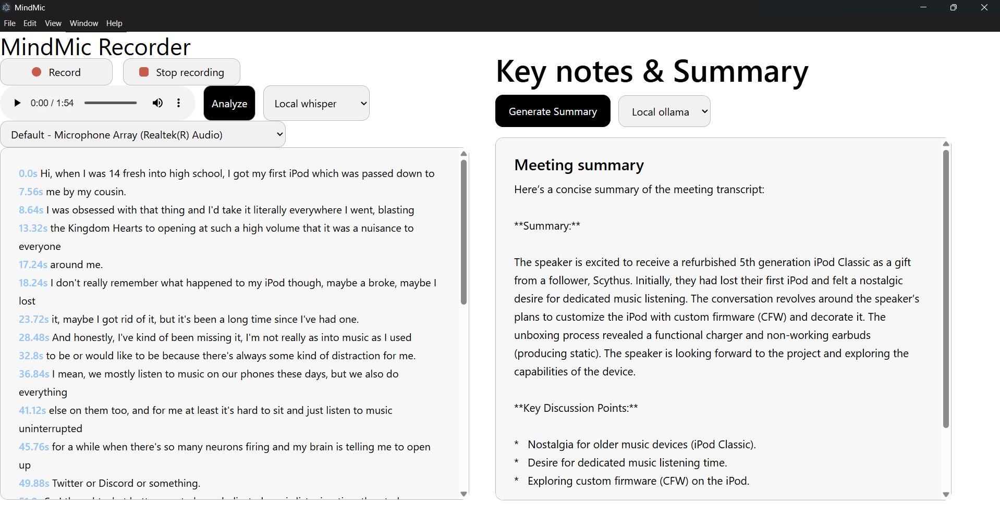

**Overview**

I built this project after attending a small meeting where I found myself constantly switching between listening and taking notes. At some point, it hit me that this process could be automated.

The obvious solution was to use existing APIs or tools, but most of them aren’t free or come with limitations. So instead of complaining about it like a normal person, I built my own.

This application records conversations, transcribes them, and generates summaries automatically.

Btw features include Audio Recording, Transcription, Summarization, Local Processing and Cloud Support

---

**File structure** 

```
/MindMic-meeting-summarizer/
├─] .env (ignored)
├── .gitignore
├── electron/
│   ├── index.html
│   ├── index.js
│   ├─] node_modules/ (ignored)
│   ├── output.wav
│   ├── package-lock.json
│   ├── package.json
│   ├── preload.js
│   └── renderer/
│       └── app.js
├── example.env
├─] node_modules/ (ignored)
├── package-lock.json
├── package.json
├── README.md
├── router/
│   └── apiConfig.js
├── sound-recorder/
│   ├── package-lock.json
│   ├── package.json
│   └── record.js
├── transcribe.py
└── transcription.txt
```
---
**Setup guide**

First you are required to have [ffpeg](https://github.com/BtbN/FFmpeg-Builds/releases) setuped in environment system path for it to work. 
Process: extract it > open environment variables > path > add `C:\ffmpeg\bin`.

Install faster-whisper for voice transcription

we have a frontend/main application inside electron folder can be started just by going inside electron folder and  can be started using  **`npm install && npm start`**


renderer/app.js includes code which connects backend and frontend also includes code which displays logs in console.

sound-recorder/record.js includes ffpeg setup for my application which is how we are recording audio. Also came to know recently that YouTube infra heavily uses ffpeg. 

above setup was for audio recording now lets start with transcribing it

start by creating an venv for python in root directory, followed by activating that venv which you just created and **`install faster-whisper`** which we are using to transcribe audio. ps, we can check that by using **`python transcribe.py`**. which which transcribe and write logs to transcription.txt.

---
**Installing faster-whisper**

```
py -m venv .venv
source .venv/Scripts/activate
pip install faster-whisper
```
---
**Screenshort**

<!-- Feedback: [click here to open](https://forms.gle/MoV2Bv6R79dRDKvGA) -->